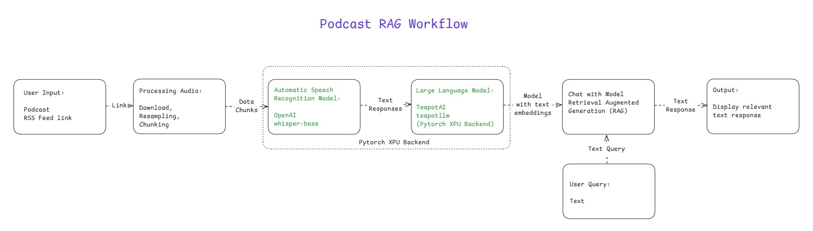

# Podcast RAG
## Introduction

This sample demonstrates a Retrieval-Augmented Generation (RAG) system using a **Podcast episode** as the knowledge base, with text query capability, served through a **Streamlit** web app.
An RSS feed link is the input used to list and select a specific podcast episode for download. The selected audio undergoes preprocessing steps such as resampling and chunking to prepare it for transcription.
Each chunk is transcribed to text using the [**Whisper base model**](https://huggingface.co/openai/whisper-base) via an Automatic Speech Recognition (ASR) pipeline optimized to run on **Intel® Core™ Ultra Processors** with [**PyTorch XPU backend**](https://pytorch.org/docs/stable/notes/get_start_xpu.html) for hardware acceleration.
These transcriptions are embedded and indexed to create a searchable knowledge base for retrieval.
User questions are answered by a local LLM served through the **OpenVINO Model Server**, running entirely on-device and streamed back to the app in real time.

---

## Table of Contents

- [Architecture](#architecture)
- [Project Structure](#project-structure)
- [Prerequisites](#prerequisites)
- [Installing Prerequisites && Setting Up the Environment](#installing-prerequisites--setting-up-the-environment)
   - [For Windows](#for-windows)
   - [For Linux](#for-linux)
- [Start the OpenVINO Model Server](#start-the-openvino-model-server)
- [Running the Sample](#running-the-sample)
- [Running the RAG Flow](#running-the-rag-flow)
- [Troubleshooting](#troubleshooting)
- [License](#license)

---

## Architecture

- User provides an `RSS feed URL` (or picks one of the built-in feeds) to list available podcast episodes.
- The selected audio podcast episode is downloaded, resampled and then split into chunks.
- Each chunk is transcribed to text using the [*Whisper base model*](https://huggingface.co/openai/whisper-base) (ASR).
- Transcribed text chunks are embedded and indexed to create a searchable knowledge base.
- A text question from the user is answered by a local LLM served through the **OpenVINO Model Server**, using the retrieved chunks as context, and streamed back to the Streamlit UI.



---

## Project Structure

    podcast_rag/                                                          # Project Sample folder
    ├── assets/                                                           # Assets folder which contains the images and diagrams
    │   ├── Query_rag_response.png                                        # Output screenshot image 2
    │   ├── Generating_podcast_audio_transcriptions_using_Pytorch_XPU.png # Output screenshot image 1
    │   └── Podcast_rag_workflow.png                                     # Workflow image
    ├── podcast_rag_app.py                                                # Streamlit app — the sample's entry point
    ├── Readme.md                                                         # Readme file which contains all the details and instructions about the project sample
    ├── pyproject.toml                                                    # Requirements for the project sample
    └── uv.lock                                                           # File which captures the packages installed for the project sample

---

## Prerequisites

|    Component   |   Recommended   |
|   ------   |   ------   |
|   Operating System(OS)   |   Windows 11 or later/ Ubuntu 20.04 or later   |
|   Random-access memory(RAM)   |   16 GB   |
|   Hardware   |   Intel® Core™ Ultra Processors, Intel Arc™ Graphics, Intel Graphics   |

---

## Installing Prerequisites && Setting Up the Environment

### For Windows:
To install any software using commands, Open the Command Prompt as an administrator by right-clicking the terminal icon and selecting `Run as administrator`.
1. **GPU Drivers installation**\
   Download and install the Intel® Graphics Driver for Intel® Arc™ B-Series, A-Series, Intel® Iris® Xe Graphics, and Intel® Core™ Ultra Processors with Intel® Arc™ Graphics from [here](https://www.intel.com/content/www/us/en/download/785597/intel-arc-iris-xe-graphics-windows.html)\
   **IMPORTANT:** Reboot the system after the installation.

2. **CMake for Windows**\
   Download and install the latest CMake for Windows from [here](https://cmake.org/download/)

3. **Git for Windows**\
   Download and install Git from [here](https://git-scm.com/downloads/win)

4. **uv for Windows**\
   Steps to install `uv` in the Command Prompt are as follows. Please refer to the [documentation](https://docs.astral.sh/uv/getting-started/installation/) for more information.
   ```
   powershell -ExecutionPolicy ByPass -c "irm https://astral.sh/uv/install.ps1 | iex"
   ```
   **NOTE:** Close and reopen the Command Prompt to recognize uv.
   
### For Linux:
To install any software using commands, Open a new terminal window by right-clicking the terminal and selecting `New Window`.
1. **GPU Drivers installation**\
   Download and install the GPU drivers from [here](https://dgpu-docs.intel.com/driver/client/overview.html)

2. **Dependencies on Linux**\
   Install CMake, Curl, Wget, Git using the following commands:
   - For Debian/Ubuntu-based systems:
   ```
   sudo apt update && sudo apt -y install cmake curl wget git
   ```
   - For RHEL/CentOS-based systems:
   ```
   sudo dnf update && sudo dnf -y install cmake curl wget git
   ```

3. **uv for Linux**\
   Steps to install uv are as follows. Please refer to the [documentation](https://docs.astral.sh/uv/getting-started/installation/) for more information.
   - If you want to use curl to download the script and execute it with sh:
   ```
   curl -LsSf https://astral.sh/uv/install.sh | sh
   ```
   - If you want to use wget to download the script and execute it with sh:
   ```
   wget -qO- https://astral.sh/uv/install.sh | sh
   ```
   **NOTE:** Close and reopen the Terminal to recognize uv.

---

## Start the OpenVINO Model Server

The Streamlit app answers questions using a local LLM served by the **OpenVINO Model Server**, which must be running before you launch the app.

1. Clone the setup scripts from the [`aipc-devkit-install`](https://github.com/intel/aipc-devkit-install) repo:
   ```
   git clone https://github.com/intel/aipc-devkit-install.git
   cd aipc-devkit-install/Windows_Software_Installation/OVMS
   ```
   (See [README_OVMS_AGENTIC.md](https://github.com/intel/aipc-devkit-install/blob/main/Windows_Software_Installation/OVMS/README_OVMS_AGENTIC.md) in that repo for the full set of options.)

2. Start the OpenVINO Model Server with a model and target device, for example:
   ```
   Powershell.exe -ExecutionPolicy Bypass -File .\ovms_agentic_setup.ps1 -Model "OpenVINO/Qwen3-8b-int4-ov" -Target GPU
   ```

3. **Wait** until the model finishes downloading and the server reports it is up and running — the OpenVINO Model Server serves an OpenAI-compatible API at `http://localhost:8000/v3` by default, which is exactly what the Streamlit app expects. Leave this window open; it needs to keep running while you use the app.

---

## Running the Sample

1. In the Command Prompt/terminal, navigate to the `podcast_rag` folder after cloning the sample:
   ```
   cd <path/to/podcast_rag/folder>
   ```
   
2. Sync the UV environment:\
   On Windows:
   ```
   set CMAKE_POLICY_VERSION_MINIMUM=3.5
   uv sync
   ```
   On Linux:
   ```
   uv sync
   ```
   
3. Log in to Hugging Face, generate a token, and download the required models:\
   `huggingface-cli` lets you interact directly with the Hugging Face Hub from a terminal. Log in to [Huggingface](https://huggingface.co/) with your credentials. You need a [User Access Token](https://huggingface.co/docs/hub/security-tokens) from your [Settings page](https://huggingface.co/settings/tokens). The User Access Token is used to authenticate your identity to the Hub.\
   Once you have your token, run the following command in your terminal.
   ```
   uv run huggingface-cli login
   ```
   This command will prompt you for a token. Copy-paste yours and press Enter.
   ```
   uv run huggingface-cli download openai/whisper-base
   ```

4. With the OpenVINO Model Server already running (see previous section), launch the Streamlit app:
   ```
   uv run streamlit run podcast_rag_app.py
   ```
   The app opens in your browser and, by default, talks directly to the OpenVINO Model Server running in the background at `http://localhost:8000/v3` — no extra configuration needed.

---

## Running the RAG Flow

Once the app is open in your browser:

1. **Step 1 — Select Podcast Feed:** Choose a feed from the dropdown (or pick `Other (enter your own RSS URL)` and paste your own RSS feed URL), then click **🔄 Load Episodes**.
2. **Step 2 — Select Episode:** Optionally filter by recency, then pick the episode you want to explore from the list.
3. **Step 3 — Initialize Models & Process Audio:** Click to download the episode audio and transcribe it with Whisper. GPU utilization can be seen in the Task Manager while transcription runs on Intel XPUs.
4. **Step 4 — Ask Questions:** Use one of the quick-question buttons or type your own question. The answer is retrieved from the transcript and streamed back live from the OpenVINO Model Server.

---

## Troubleshooting

- **Dependency Issues:** Run `uv clean` and then `uv sync`.
- **CMake compatibility issues:** Run `set CMAKE_POLICY_VERSION_MINIMUM=3.5` to prevent building issues.
- **App can't reach the LLM / no streamed answer:** Confirm the OpenVINO Model Server window is still running and reachable at `http://localhost:8000/v3` before asking a question in the app.

---

## License

This project is licensed under the MIT License. See [LICENSE](../LICENSE) for details.
