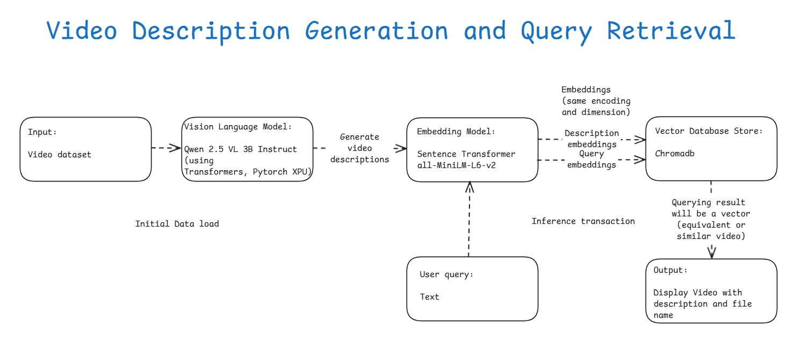

# Video Description Generation and Query Retrieval with Ollama
## Introduction

This sample demonstrates how to generate video descriptions using [**Ollama**](https://ollama.ai) vision models and store their embeddings in [**ChromaDB**](https://www.trychroma.com/) for efficient semantic search on **Intel® Core™ Ultra Processors** and **Intel® Arc™ Graphics**.

Ollama provides an optimized runtime for vision-language models (Qwen 2.5 VL, Llama 3.2 Vision, LLaVA) with simplified deployment on Intel GPUs. For each video, a description is generated and stored as an embedding in ChromaDB. When a user submits a query, cosine similarity search is performed in ChromaDB to retrieve the most relevant video description.

This sample uses the videos from the [**stepfun-ai/Step-Video-T2V-Eval**](https://huggingface.co/datasets/stepfun-ai/Step-Video-T2V-Eval) Hugging Face dataset. For more information on the dataset and citation requirements, please refer to the [**Step-Video-T2V Technical Report paper**](https://arxiv.org/abs/2502.10248).

### Available Interfaces:

- `Video_RAG_Ollama.ipynb` - Jupyter notebook implementation
- `st_video_rag_demo.py` - Streamlit web interface

---

## Table of Contents

- [Architecture](#architecture)
- [Project Structure](#project-structure)
- [Dataset Details](#dataset-details)
- [Prerequisites](#prerequisites)
- [Installing Prerequisites && Setting Up the Environment](#installing-prerequisites--setting-up-the-environment)
   - [For Windows](#for-windows)
   - [For Linux](#for-linux)
- [Running the Sample && execution output](#running-the-sample--execution-output)
- [Troubleshooting](#troubleshooting)
- [Dataset Citations](#dataset-citations)
- [License](#license)

---

## Architecture

### System Workflow

```
┌─────────────────────────────────────────────────────────────────────┐
│                    VIDEO PROCESSING PIPELINE                        │
└─────────────────────────────────────────────────────────────────────┘
                                    
Video Files ──► Frame Extraction ──► Ollama Vision Model ──► Text Descriptions
                                            │
                                            │ (Accelerated by Intel GPUs)
                                            ▼
                              Sentence Transformer ──► ChromaDB Storage
                                                              │
┌─────────────────────────────────────────────────────────────┘
│                    SEARCH PIPELINE                              
└─────────────────────────────────────────────────────────────────────┐
                                                                      │
User Query ──► Query Embedding ──► Cosine Similarity ◄────────────────┘
                                           │
                                           ▼
                                   Ranked Results ──► Display Videos

┌─────────────────────────────────────────────────────────────────────┐
│  Hardware: Intel Arc™ Graphics | Core™ Ultra | Iris® Xe Graphics   │
└─────────────────────────────────────────────────────────────────────┘
```

### Workflow Details

**Video Processing Pipeline:**

1. **Video Input**: Videos from [Step-Video-T2V-Eval](https://huggingface.co/datasets/stepfun-ai/Step-Video-T2V-Eval) dataset
2. **Frame Extraction**: Representative frames extracted using OpenCV
3. **Vision Model**: Ollama runtime with Qwen 2.5 VL, Llama 3.2 Vision, or LLaVA on Intel GPU
4. **Description Generation**: Detailed text descriptions of video content
5. **Embedding Creation**: Text → vector embeddings via [Sentence Transformers](https://sbert.net/) ([all-MiniLM-L6-v2](https://huggingface.co/sentence-transformers/all-MiniLM-L6-v2))
6. **Storage**: Embeddings + metadata stored in [ChromaDB](https://www.trychroma.com/) vector database

**Search Pipeline:**

1. **User Query**: Natural language text input (e.g., "person playing basketball")
2. **Query Embedding**: Convert query to vector using same embedding model
3. **Similarity Search**: Cosine similarity search over ChromaDB collection
4. **Ranked Results**: Return top matching videos with similarity scores
5. **Display**: Show videos with descriptions and match quality

**Intel Hardware Optimization:**

- **Intel Arc™ Graphics**: GPU acceleration for vision model inference
- **Intel Core™ Ultra Processors**: Optimized CPU performance
- **Intel Iris® Xe Graphics**: Integrated graphics acceleration
- **Local Processing**: No cloud dependency, all computation on-device
- **Ollama Runtime**: Optimized for Intel hardware



---

## Project Structure

    Video-Description-Generation-Query-Retrieval/                          # Project Sample folder
    ├── assets/                                                            # Assets folder with images and diagrams
    │   ├── Generating_video_descriptions_using_Pytorch_XPU.png            # PyTorch XPU output screenshot
    │   ├── Video_description_generation_and_query_retrieval_workflow.jpg  # Workflow diagram
    │   └── Video_display.png                                              # Video display screenshot
    ├── Readme.md                                                          # Main README
    ├── Video_RAG_Ollama.ipynb                                             # Ollama-based notebook
    ├── st_video_rag_demo.py                                               # Streamlit web interface
    ├── pyproject.toml                                                     # UV/pip requirements
    └── uv.lock                                                            # UV lock file

---

## Dataset Details

In this project sample, we are going to use [Step-Video-T2V-Eval](https://huggingface.co/datasets/stepfun-ai/Step-Video-T2V-Eval) Hugging Face dataset which has **128 videos**. 
Step-Video-T2V Eval benchmark features 128 prompts. This benchmark is designed to evaluate the quality of generated videos across **11 distinct categories**.
They are Sports, Food, Scenery, Animals, Festivals, Combination Concepts, Surreal, People, 3D Animation, Cinematography, and Style.

Please find the some of the keywords below used in the prompts across 11 different categories.

**Sports** --> *Soccer, basketball, tennis, running, badminton, table tennis, Dumbells lifting, Golf, Skateboard, skiers gliding, Water surfer, sand pit jump.*\
**Food** --> *Sliced meat, French roast, Spaghetti, Sushi, Naan with Chicken, Taco, Pad thai, Fish with vegetables, Grilled kebab, Burgers, Kebab.*\
**Scenery** --> *Mountains, Blue ocean, Waterfall, Towers, Kremlin wall, Sailboat, Buildings, Modern city, sunset, river, hills.*\
**Animals** --> *Lion, Dog, Birds, Dolphins, Elephant, sharks, Snake, Butterfly, Kangaroo, penguins, cheetah, Kitten.*\
**Festivals** --> *Christmas, lantern, Halloween.*\
**Combination concepts, Surreal, People, 3D Animation, Cinematography, Style**

---

## Prerequisites

|    Component   |   Recommended   |
|   ------   |   ------   |
|   Operating System(OS)   |   Windows 11 or later/ Ubuntu 20.04 or later   |
|   Random-access memory(RAM)   |   32 GB   |
|   Hardware   |   Intel® Core™ Ultra Processors, Intel Arc™ Graphics, Intel Graphics, Intel® Xeon® Processor   |

---

## Installing Prerequisites && Setting Up the Environment

### For Windows:
To install any software using commands, Open the Command Prompt as an administrator by right-clicking the terminal icon and selecting `Run as administrator`.

1. **GPU Drivers installation**\
   Download and install the Intel® Graphics Driver for Intel® Arc™ B-Series, A-Series, Intel® Iris® Xe Graphics, and Intel® Core™ Ultra Processors with Intel® Arc™ Graphics from [here](https://www.intel.com/content/www/us/en/download/785597/intel-arc-iris-xe-graphics-windows.html)\
   **IMPORTANT:** Reboot the system after the installation.

2. **Ollama Installation**\
   Download and install Ollama from [https://ollama.com/download](https://ollama.com/download) or use the command:
   ```powershell
   winget install Ollama.Ollama
   ```

   **Building Ollama with GPU Support (Vulkan)**\
   For advanced users who want to build Ollama from source with Vulkan GPU acceleration:

   a. **Install Vulkan SDK**
   - Download and install from [https://vulkan.lunarg.com/sdk/home](https://vulkan.lunarg.com/sdk/home)
   
   b. **Install TDM-GCC**
   - Download and install from [https://github.com/jmeubank/tdm-gcc/releases/tag/v10.3.0-tdm64-2](https://github.com/jmeubank/tdm-gcc/releases/tag/v10.3.0-tdm64-2)
   
   c. **Install Go SDK**
   - Download and install Go v1.24.9 from [https://go.dev/dl/go1.24.9.windows-amd64.msi](https://go.dev/dl/go1.24.9.windows-amd64.msi)
   
   d. **Build Ollama with Vulkan**
   ```powershell
   # Set environment variables
   set CGO_ENABLED=1
   set CGO_CFLAGS=-IC:\VulkanSDK\1.4.321.1\Include
   
   # Build with CMake
   cmake -B build
   cmake --build build --config Release -j14
   
   # Build Go binary
   go build
   
   # Run Ollama server (Terminal 1)
   go run . serve
   
   # Test with a model (Terminal 2)
   ollama run gemma3:270m
   ```

3. **Git for Windows**\
   Download and install Git from [here](https://git-scm.com/downloads/win)

4. **uv for Windows**\
   Steps to install `uv` in the Command Prompt are as follows. Please refer to the [documentation](https://docs.astral.sh/uv/getting-started/installation/) for more information.
   ```powershell
   powershell -ExecutionPolicy ByPass -c "irm https://astral.sh/uv/install.ps1 | iex"
   ```
   **NOTE:** Close and reopen the Command Prompt to recognize uv.
   
### For Linux:
To install any software using commands, Open a new terminal window by right-clicking the terminal and selecting `New Window`.

1. **GPU Drivers installation**\
   Download and install the GPU drivers from [here](https://dgpu-docs.intel.com/driver/client/overview.html)

2. **Ollama Installation**\
   Install Ollama using the official script:
   ```bash
   curl -fsSL https://ollama.com/install.sh | sh
   ```

3. **Dependencies on Linux**\
   Install Curl, Wget, Git using the following commands:
   - For Debian/Ubuntu-based systems:
   ```bash
   sudo apt update && sudo apt -y install curl wget git
   ```
   - For RHEL/CentOS-based systems:
   ```bash
   sudo dnf update && sudo dnf -y install curl wget git
   ```

3. **uv for Linux**\
   Steps to install uv are as follows. Please refer to the [documentation](https://docs.astral.sh/uv/getting-started/installation/) for more information.
   - If you want to use curl to download the script and execute it with sh:
   ```
   curl -LsSf https://astral.sh/uv/install.sh | sh
   ```
   - If you want to use wget to download the script and execute it with sh:
   ```
   wget -qO- https://astral.sh/uv/install.sh | sh
   ```
   **NOTE:** Close and reopen the Terminal to recognize uv.

---

## Running the Sample

### Quick Start with Streamlit (Recommended)

1. **Navigate to project folder:**
   ```bash
   cd <path/to/Video-Description-Generation-Query-Retrieval/folder>
   ```

2. **Pull an Ollama vision model:**
   ```bash
   ollama pull qwen2.5-vl
   # OR
   ollaa pull qwen3-vl:latest
   # OR
   ollama pull llama3.2-vision
   # OR  
   ollama pull llava
   ```

3. **Download the video dataset:**
   
   Log in to [Huggingface](https://huggingface.co/) and get a [User Access Token](https://huggingface.co/docs/hub/security-tokens) from your [Settings page](https://huggingface.co/settings/tokens).
   
   ```bash
   uv run huggingface-cli login
   uv run huggingface-cli download stepfun-ai/Step-Video-T2V-Eval --repo-type dataset --local-dir ./Step-Video-T2V-Eval
   ```

4. **Launch the Streamlit application:**
   ```bash
   uv run streamlit run st_video_rag_demo.py
   ```
   
   The app will open in your browser at `http://localhost:8501`

5. **Use the application:**
   - Go to "Process Videos" tab
   - Configure settings (model, dataset folder, max videos)
   - Click "Start Processing" 
   - Once complete, go to "Search Videos" tab
   - Enter natural language queries to find videos

### Alternative: Jupyter Notebook

1. **Install dependencies:**
   ```bash
   uv sync
   ```

2. **Launch Jupyter Lab:**
   ```bash
   uv run jupyter lab
   ```
   
   Open `Video_RAG_Ollama.ipynb` and run cells sequentially.

3. **Expected Output:**
   
   - GPU utilization can be monitored in Task Manager (Windows) or nvidia-smi/intel_gpu_top (Linux)
   - Processing 128 videos typically takes 10-60 minutes depending on hardware
   - Search queries return results in < 100ms
   - Videos displayed with similarity scores and descriptions

---

## Troubleshooting

**Ollama Issues:**
- **Ollama not accessible:** Check if Ollama is running with `ollama list`. Start with `ollama serve` if needed.
- **No vision model:** Pull a vision model: `ollama pull qwen2.5-vl` or `ollama pull llama3.2-vision`
- **Model too slow:** Try a smaller model like `llava` for faster inference

**Application Issues:**
- **Dependency Issues:** Run `uv clean` and then `uv sync`
- **No videos found:** Ensure video folder path is correct and contains .mp4/.avi/.mov files
- **Database errors:** Delete `Video_descriptions_database_ollama` folder and reprocess
- **Poor search results:** Check that descriptions are detailed (view in "View All Descriptions" section)

**Performance:**
- **Slow processing:** Reduce number of videos or use a faster model
- **Out of memory:** Process fewer videos at once or use a smaller model
- **GPU not utilized:** Ensure Intel GPU drivers are installed and Ollama is using GPU

---

## Dataset Citations

    @misc{ma2025stepvideot2vtechnicalreportpractice,  
      title={Step-Video-T2V Technical Report: The Practice, Challenges, and Future of Video Foundation Model}, 
      author={Guoqing Ma and Haoyang Huang and Kun Yan and Liangyu Chen and Nan Duan and Shengming Yin and Changyi Wan and Ranchen Ming and Xiaoniu Song and Xing Chen and Yu Zhou and Deshan Sun and Deyu Zhou and Jian Zhou and Kaijun Tan and Kang An and Mei Chen and Wei Ji and Qiling Wu and Wen Sun and Xin Han and Yanan Wei and Zheng Ge and Aojie Li and Bin Wang and Bizhu Huang and Bo Wang and Brian Li and Changxing Miao and Chen Xu and Chenfei Wu and Chenguang Yu and Dapeng Shi and Dingyuan Hu and Enle Liu and Gang Yu and Ge Yang and Guanzhe Huang and Gulin Yan and Haiyang Feng and Hao Nie and Haonan Jia and Hanpeng Hu and Hanqi Chen and Haolong Yan and Heng Wang and Hongcheng Guo and Huilin Xiong and Huixin Xiong and Jiahao Gong and Jianchang Wu and Jiaoren Wu and Jie Wu and Jie Yang and Jiashuai Liu and Jiashuo Li and Jingyang Zhang and Junjing Guo and Junzhe Lin and Kaixiang Li and Lei Liu and Lei Xia and Liang Zhao and Liguo Tan and Liwen Huang and Liying Shi and Ming Li and Mingliang Li and Muhua Cheng and Na Wang and Qiaohui Chen and Qinglin He and Qiuyan Liang and Quan Sun and Ran Sun and Rui Wang and Shaoliang Pang and Shiliang Yang and Sitong Liu and Siqi Liu and Shuli Gao and Tiancheng Cao and Tianyu Wang and Weipeng Ming and Wenqing He and Xu Zhao and Xuelin Zhang and Xianfang Zeng and Xiaojia Liu and Xuan Yang and Yaqi Dai and Yanbo Yu and Yang Li and Yineng Deng and Yingming Wang and Yilei Wang and Yuanwei Lu and Yu Chen and Yu Luo and Yuchu Luo and Yuhe Yin and Yuheng Feng and Yuxiang Yang and Zecheng Tang and Zekai Zhang and Zidong Yang and Binxing Jiao and Jiansheng Chen and Jing Li and Shuchang Zhou and Xiangyu Zhang and Xinhao Zhang and Yibo Zhu and Heung-Yeung Shum and Daxin Jiang},
      year={2025},
      eprint={2502.10248},
      archivePrefix={arXiv},
      primaryClass={cs.CV},
      url={https://arxiv.org/abs/2502.10248}, 
      }

---

## License

This project is licensed under the MIT License. See [LICENSE](../LICENSE) for details.
